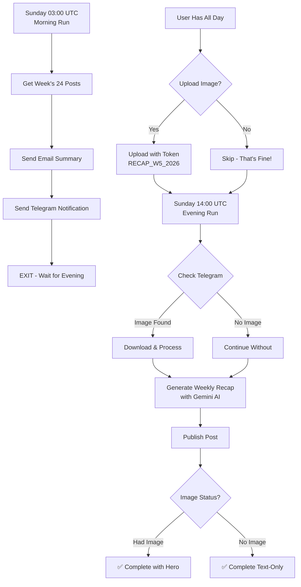

<p align="center">
  
</p>

<h1 align="center">🎬 What's Up?</h1>

<p align="center">
  <strong>Autonomous Philosophical Media Engine</strong><br>
  <em>AI-powered deep dives into the existential depths of cinema</em>
</p>

<p align="center">
  <a href="https://github.com/Ns81000/WHATSUP/actions/workflows/daily_post.yml">
    
  </a>
  <a href="https://github.com/Ns81000/WHATSUP/actions/workflows/pages-deploy.yml">
    
  </a>
  <a href="https://ns81000.github.io/WHATSUP">
    
  </a>
  
  
  
  
  
</p>

<p align="center">
  <a href="#-what-is-this">What is this?</a> •
  <a href="#-how-it-works">How it Works</a> •
  <a href="#-features">Features</a> •
  <a href="#-sunday-special">Sunday Special</a> •
  <a href="#-image-workflow">Image Workflow</a> •
  <a href="#-tech-stack">Tech Stack</a> •
  <a href="#-quick-start">Quick Start</a> •
  <a href="#-configuration">Configuration</a>
</p>

---

## 🤔 What is This?

**What's Up?** is a **fully autonomous blog** that generates philosophical movie and TV series analyses using AI. Unlike typical movie review sites that focus on ratings and plot summaries, this platform explores:

- 🧠 **Existential themes** — What does this film say about the human condition?
- 🔮 **Metaphysical questions** — How does it challenge our perception of reality?
- 💭 **Philosophical frameworks** — What schools of thought does it embody?
- ❤️ **Emotional resonance** — Why does this story move us?

> *"We don't just watch films. We explore the questions they dare to ask."*

### 📊 At a Glance

| Metric | Value | Details |
|--------|-------|---------|
| 📝 **Weekly Posts** | 25 | 24 (Mon-Sat) + 1 (Sunday Recap) |
| 🎬 **Movie Library** | 572 films | Curated IMDb watchlist |
| 📺 **Series Library** | 105 shows | Carefully selected |
| 🖼️ **Image Format** | WebP | Compressed to <500KB |
| 🤖 **AI Model** | Gemini 2.5 Flash | 800-2000 words per post |
| ⏱️ **Automation** | 100% | Zero manual intervention |
| 🌟 **Sunday Special** | Weekly Recap | Synthesizes week's posts |

---

## ⚙️ How It Works https://422442.github.io/What_Flow/

```
┌─────────────────────────────────────────────────────────────────────────────┐
│                           🕐 GITHUB ACTIONS                                 │
│                    Triggers automatically 1-2 times daily                   │
│                                                                             │
│     Mon-Sat: 08:30 AM + 05:30 PM IST (4 posts/day = 24/week)             │
│     Sunday:  08:30 AM (notification) + 07:30 PM (1 recap post)            │
└─────────────────────────────────────────────────────────────────────────────┘
                                      │
                                      ▼
┌─────────────────────────────────────────────────────────────────────────────┐
│                           🐍 PYTHON AUTOMATION                              │
│                                                                             │
│   ┌──────────────┐    ┌──────────────┐    ┌──────────────┐                │
│   │  📋 READ     │    │  🎬 FETCH    │    │  🖼️ PROCESS  │                │
│   │  CSV Lists   │───▶│  TMDB Data   │───▶│  Images      │                │
│   │  (IMDb IDs)  │    │  (metadata)  │    │  (WebP)      │                │
│   └──────────────┘    └──────────────┘    └──────────────┘                │
│                                                  │                          │
│                                                  ▼                          │
│   ┌──────────────┐    ┌──────────────┐    ┌──────────────┐                │
│   │  📝 CREATE   │    │  🤖 GENERATE │    │  🧠 ANALYZE  │                │
│   │  Jekyll Post │◀───│  Content     │◀───│  with Gemini │                │
│   │  (.md file)  │    │  (markdown)  │    │  AI          │                │
│   └──────────────┘    └──────────────┘    └──────────────┘                │
└─────────────────────────────────────────────────────────────────────────────┘
                                      │
                                      ▼
┌─────────────────────────────────────────────────────────────────────────────┐
│                           🌐 GITHUB PAGES                                   │
│                                                                             │
│              Jekyll builds static HTML → Live website updated               │
│                    https://ns81000.github.io/WHATSUP                        │
└─────────────────────────────────────────────────────────────────────────────┘
```

### The Complete Flow

| Step | What Happens | Technology |
|------|--------------|------------|
| 1️⃣ | GitHub Actions triggers on schedule | Cron jobs (UTC) |
| 2️⃣ | Python script reads from IMDb CSV lists | Pandas |
| 3️⃣ | Fetches movie/series data from TMDB API | REST API |
| 4️⃣ | Downloads and optimizes images to WebP (<500KB) | Pillow |
| 5️⃣ | Gemini AI generates philosophical analysis | Google Gemini 2.5 Flash |
| 6️⃣ | Creates Jekyll markdown post with frontmatter | Python |
| 7️⃣ | Commits and pushes to repository | Git |
| 8️⃣ | Jekyll builds and deploys to GitHub Pages | GitHub Actions |

---

## ✨ Features

### 🤖 Fully Autonomous
Zero human intervention required. The system runs 24/7, generating fresh content every day.

### 📅 Smart Scheduling

| Day | Runs | Posts | Timing (IST) |
|-----|------|-------|--------------|
| Monday - Saturday | 2 | 4 posts | 08:30 AM, 05:30 PM |
| Sunday | 2 | 1 recap | 08:30 AM (notification), 07:30 PM (recap) |

**Weekly output:** 25 posts (24 regular + 1 Sunday recap)

### 🖼️ Intelligent Image Handling

```
TMDB API Available?
       │
       ├── YES → Download backdrop → Convert to WebP → Compress to <500KB
       │
       └── NO → Pre-check system alerts you 6 hours in advance
                      │
                      ├── Telegram Bot notification
                      └── Email notification (SMTP)
                              │
                              ▼
                      Upload manually → Next run processes it
```

### 🧠 AI-Powered Content

Each post includes:

| Section | Description |
|---------|-------------|
| **Opening Hook** | Philosophical quote or thought-provoking question |
| **Thematic Analysis** | Deep dive into existential/metaphysical themes |
| **Character Study** | Psychological examination of key characters |
| **Visual Storytelling** | Analysis of cinematography and symbolism |
| **The Question It Asks** | Core philosophical inquiry of the work |
| **Streaming Info** | Where to watch (via TMDB data) |

### 🏷️ Mood Categorization

Every post is tagged with a philosophical mood:

| Mood | Description | Example Films |
|------|-------------|---------------|
| 🧠 Cerebral | Intellectually challenging | Inception, Primer |
| 😢 Melancholy | Sad, wistful | Eternal Sunshine, Her |
| 🌅 Hopeful | Optimistic, uplifting | The Shawshank Redemption |
| ⚡ Intense | High tension, gripping | Whiplash, Uncut Gems |
| 🕰️ Nostalgic | Evokes longing | Cinema Paradiso |
| ❓ Existential | Questions existence | Blade Runner, 2001 |
| 💕 Romantic | Love-focused | Before Sunrise |
| 🦸 Heroic | Triumphant, inspiring | Rocky, Gladiator |
| 🌑 Dystopian | Dark future | The Matrix, Children of Men |
| 🌀 Surreal | Dreamlike, abstract | Mulholland Drive |

### 🔍 Pre-Check System

The system looks **ahead** at the next scheduled items:

```python
# Before processing current items, check if NEXT items have images
if not check_image_availability(next_movie):
    trigger_manual_fallback()  # Sends Telegram/Email alert
```

This gives you **6+ hours** to manually upload images before they're needed.

---

## 🌟 Sunday Special - Weekly Recap

Every Sunday has **two runs** with different purposes:

### 🌅 Sunday Morning (08:30 AM IST / 03:00 UTC) - Notification Only

**Purpose:** Give you the full day to upload a custom hero image!

**What Happens:**
1. ✉️ **Email sent** with week's summary (all 24 posts from Mon-Sat)
2. 📱 **Telegram notification** with upload token
3. ⏸️ **Script exits** - no post generation yet
4. ⏰ **Deadline reminder:** Upload before 7:30 PM IST

**Sample Email:**
```
🌟 Sunday Special - Weekly Recap Coming Tonight!

This week's posts:
1. Film A (Monday)
2. Film B (Monday)
...
24. Film X (Saturday)

📸 Upload Hero Image - Deadline: 7:30 PM IST
Token: RECAP_W5_2026

Tonight at 7:30 PM: Script will check Telegram + generate recap
```

### 🌙 Sunday Evening (07:30 PM IST / 14:00 UTC) - Recap Generation

**Purpose:** Generate and publish the weekly synthesis!

**What Happens:**
1. 🔍 **Check Telegram** for uploaded image (token: `RECAP_W5_2026`)
2. 🖼️ **Process image** if found (or continue without)
3. 🤖 **Generate recap** weaving all 24 posts into one narrative
4. 📝 **Publish post** with or without hero image
5. ✅ **Complete** - week's journey documented

### What Makes It Special?

| Feature | Description |
|---------|-------------|
| ⏰ **Split Workflow** | Morning notification + Evening generation (19.5 hour gap) |
| 📊 **Weekly Summary** | Lists all 24 posts from Monday-Saturday |
| 🧵 **Thematic Synthesis** | AI finds common philosophical threads across all films |
| 📖 **1500-2000 Words** | Longer, more comprehensive than regular posts |
| 💭 **6-8 Philosopher Quotes** | Nietzsche, Camus, Sartre, Heidegger, etc. |
| 🎨 **Optional Hero Image** | Upload anytime before 7:30 PM (or skip it) |
| ✨ **Beautiful Formatting** | Multiple blockquotes, horizontal rules, rich markdown |

### How It Works



### Week Calculation Logic

```python
def get_week_posts_from_history():
    today = datetime.now()
    
    if today.weekday() == 6:  # Sunday
        # Use THIS week's Monday (current week being completed)
        monday = today - timedelta(days=6)
    else:
        # For any other day, get most recent Monday
        monday = today - timedelta(days=today.weekday())
    
    # Calculate end of week
    sunday = monday + timedelta(days=6)
    
    # Filter: monday <= post_date <= sunday
    # Ensures only current week's posts are included
```

### Sample Weekly Recap Structure

```markdown
---
title: "Echoes of Eternity: A Week Through Time, Memory, and Becoming"
categories: [Weekly Recap, Philosophical]
tags: [Cerebral, Existential, Profound]
---

> "Time is the substance of which I am made..." — Jorge Luis Borges
{: .prompt-tip }

This week, cinema became our **philosophical laboratory**...

## The Philosophical Thread
[Reveals common themes across all 24 films]

> "Memory is not what we remember..." — André Bazin
{: .prompt-info }

## The Journey Through Cinema

**Film 1**: How it explores mortality and choice...
**Film 2**: Its meditation on identity and becoming...
[Continues through all 24 posts]

---

## Deeper Waters: The Human Condition

[Synthesis of universal truths]

> "The absurd is the essential concept..." — Albert Camus
{: .prompt-warning }

[Final reflections and questions for the reader]
```

---

## 🖼️ Image Workflow - Intelligent Fallback System

The system has a sophisticated 3-tier image handling strategy:

### Tier 1: TMDB API (Primary)

```
┌─────────────────────────────────────────┐
│  Check TMDB for High-Quality Images    │
│  Requirement: width >= 1920px           │
└─────────────────────────────────────────┘
                  │
         ┌────────┴────────┐
         │                 │
    ✅ Found          ❌ Not Found
         │                 │
         ▼                 ▼
   Download &          Go to Tier 2
   Process           (Pre-Check Alert)
```

### Tier 2: Pre-Check Alert System (6-Hour Warning)

When TMDB doesn't have images for the **NEXT** scheduled post:

**1. Telegram Notification:**

```
🎬 Manual Upload Required

Title: Inception
IMDb ID: tt1375666

📸 Upload Images with These Captions:

1️⃣ HERO_tt1375666 (Landscape/Backdrop - REQUIRED)
2️⃣ IMG1_tt1375666 (Optional)
3️⃣ IMG2_tt1375666 (Optional)
4️⃣ IMG3_tt1375666 (Optional)

⏰ Deadline: Before next scheduled run (~6 hours)
```

**2. Email Alert:**

```
Subject: 🎬 Action Required: Image Missing for Inception

⚠️ Manual Image Upload Required
Title: Inception
IMDb ID: tt1375666

Please check your Telegram and upload required images.
```

### Tier 3: Graceful Fallback

If no images are available (even after alert):

```python
# Script continues without blocking
if not images:
    print("⚠️ No images available - post will be created without hero image")
    has_images = False
    
# Gemini generates post anyway
content = generate_blog_post(data, tmdb_data, media_type, has_images=False)
```

### Image Detection Rules

| Scenario | HERO Image | Body Images | Alert Sent? | Result |
|----------|-----------|-------------|-------------|--------|
| Perfect | ✅ ≥1920px | ✅ 3 images | ❌ No | All images downloaded |
| Good | ✅ ≥1920px | ⚠️ 2 images | ❌ No | Hero + 2 images |
| Acceptable | ✅ ≥1920px | ❌ 0 images | ❌ No | Hero only |
| Alert! | ❌ None | ✅ Any | ✅ YES | Only HERO missing triggers alert |
| Fallback | ❌ None | ❌ None | ✅ YES | Post created text-only |

**Key Point:** Only the **HERO image** (landscape, ≥1920px) triggers notifications. Body images (IMG1-3) are completely optional.

### Complete Image Flow Example

**Thursday 03:00 UTC - Current Run:**

```
1. Process Movie "Interstellar"
   ├─ check_telegram_for_uploads(tt0816692)
   │  └─ Not found (no manual upload)
   │
   ├─ fetch_tmdb_data(tt0816692)
   │  └─ Found: 15 backdrops
   │
   ├─ download_and_process_images()
   │  ├─ Download hero (3840x2160) → tt0816692_hero.webp (485KB) ✅
   │  ├─ Download img1 (1920x1080) → tt0816692_1.webp (287KB) ✅
   │  └─ Download img2 (1920x1080) → tt0816692_2.webp (265KB) ✅
   │
   └─ Generate post with 3 images ✅

2. Pre-Check Next Movie "Inception"
   ├─ check_image_availability(tt1375666)
   │  └─ TMDB: No backdrops >= 1920px ❌
   │
   └─ trigger_manual_fallback()
      ├─ Send Telegram notification 📱
      └─ Send email alert ✉️
```

**Thursday 05:00 - User Uploads:**

```
[User uploads to Telegram]
📷 Photo 1 with caption: HERO_tt1375666
📷 Photo 2 with caption: IMG1_tt1375666
```

**Friday 09:00 UTC - Next Run:**

```
1. Process Movie "Inception"
   ├─ check_telegram_for_uploads(tt1375666)
   │  ├─ Found HERO_tt1375666 ✅
   │  ├─ Found IMG1_tt1375666 ✅
   │  └─ Download both images
   │
   ├─ process_and_save_image()
   │  ├─ HERO → tt1375666_hero.webp (492KB) ✅
   │  └─ IMG1 → tt1375666_1.webp (298KB) ✅
   │
   ├─ Delete Telegram messages 🗑️
   │
   └─ Generate post with 2 images ✅
```

### Sunday Special Image Handling

For weekly recaps, the system uses a simplified token:

```
Token: RECAP_W5_2026 (Week number + Year)

Example Telegram message:
"Upload hero image for Week 5 recap with caption: RECAP_W5_2026"
```

- **Optional**: If no image uploaded, recap publishes text-only
- **Non-blocking**: Never waits or times out
- **Notification**: Reminds user for next week if no image provided

---

## 🛠️ Tech Stack

### Core Technologies

| Layer | Technology | Version | Purpose |
|-------|------------|---------|---------|
| **Frontend** | Jekyll + Chirpy Theme | 4.3+ | Beautiful, responsive static site generator |
| **Hosting** | GitHub Pages | - | Free, fast, reliable hosting with CDN |
| **CI/CD** | GitHub Actions | - | Automated workflows & cron scheduling |
| **Language** | Python | 3.11+ | Core automation & data processing |
| **AI Engine** | Google Gemini | 2.5 Flash | Philosophical content generation |
| **Media API** | TMDB API | v3 | Movie/series metadata & images |
| **Image Processing** | Pillow | 10.0+ | WebP conversion, resize, compression |
| **Data Handling** | Pandas | 2.0+ | CSV parsing & manipulation |
| **Notifications** | Telegram Bot API | - | Real-time image upload alerts |
| **Email** | SMTP (Gmail) | - | Email notifications for manual fallback |
| **Comments** | Giscus | - | GitHub Discussions-based comments |
| **Search** | Pagefind | - | Fast static site search |
| **Analytics** | Google Analytics | GA4 | Traffic tracking & insights |

### Python Dependencies

```text
google-generativeai>=0.8.0    # Gemini AI SDK
pandas>=2.0.0                 # Data manipulation
requests>=2.31.0              # HTTP requests
Pillow>=10.0.0                # Image processing
python-dotenv>=1.0.0          # Environment variables
```

### Architecture Diagram

```
┌─────────────────────────────────────────────────────────────────────┐
│                          GITHUB REPOSITORY                          │
├─────────────────────────────────────────────────────────────────────┤
│                                                                     │
│  ┌──────────────┐      ┌──────────────┐      ┌──────────────┐    │
│  │   data/      │      │  scripts/    │      │   _posts/    │    │
│  │   movies.csv │      │   main.py    │      │  (auto-gen)  │    │
│  │   series.csv │      │              │      │              │    │
│  └──────┬───────┘      └──────┬───────┘      └──────▲───────┘    │
│         │                     │                     │             │
│         └──────────┬──────────┘                     │             │
│                    │                                │             │
│                    ▼                                │             │
│         ┌──────────────────────┐                   │             │
│         │  GITHUB ACTIONS      │                   │             │
│         │  ┌────────────────┐  │                   │             │
│         │  │ daily_post.yml │──┼───────────────────┘             │
│         │  └────────────────┘  │                                 │
│         └──────────────────────┘                                 │
│                    │                                              │
└────────────────────┼──────────────────────────────────────────────┘
                     │
         ┌───────────┼───────────┐
         │           │           │
         ▼           ▼           ▼
    ┌────────┐  ┌────────┐  ┌────────┐
    │ TMDB   │  │Gemini  │  │Telegram│
    │  API   │  │   AI   │  │  Bot   │
    └────────┘  └────────┘  └────────┘
         │           │           │
         └───────────┼───────────┘
                     │
                     ▼
         ┌───────────────────────┐
         │   GITHUB PAGES CDN    │
         │ ns81000.github.io/... │
         └───────────────────────┘
```

### Workflow Files

**`.github/workflows/daily_post.yml`** - Main automation

```yaml
name: What's Up? Daily Post Automation

on:
  schedule:
    # Monday-Sunday at 03:00, 09:00, 12:00 UTC
    - cron: '0 3 * * *'
    - cron: '0 9 * * *'
    - cron: '0 12 * * *'
    # Sunday special at 14:00 UTC
    - cron: '0 14 * * 0'
  workflow_dispatch:
    inputs:
      skip_delay:
        description: 'Skip random delay'
        type: boolean
        default: false

jobs:
  generate-and-publish:
    runs-on: ubuntu-latest
    steps:
      - name: Checkout repository
      - name: Set up Python 3.11
      - name: Install dependencies
      - name: Run automation script
      - name: Commit and push changes
```

**`.github/workflows/pages-deploy.yml`** - Jekyll deployment

```yaml
name: Deploy Jekyll with GitHub Pages

on:
  push:
    branches: [main]
    paths-ignore:
      - .gitignore
      - README.md
      - LICENSE

jobs:
  build:
    runs-on: ubuntu-latest
    steps:
      - name: Checkout
      - name: Setup Pages
      - name: Setup Ruby
      - name: Build with Jekyll
      - name: Upload artifact

  deploy:
    needs: build
    runs-on: ubuntu-latest
    steps:
      - name: Deploy to GitHub Pages
```

---

## 📁 Project Structure

```
WHATSUP/
│
├── 📂 .github/workflows/          # GitHub Actions
│   ├── daily_post.yml             # Main automation (4-5 posts/day)
│   └── pages-deploy.yml           # Jekyll build & deploy
│
├── 📂 _posts/                     # Generated blog posts (auto-populated)
│   ├── 2026-02-02-interstellar-beyond-the-stars.md
│   ├── 2026-02-02-breaking-bad-the-descent.md
│   └── ... (grows daily)
│
├── 📂 assets/
│   ├── 📂 img/
│   │   ├── 📂 posts/              # Post images (WebP, <500KB)
│   │   │   ├── tt0816692_hero.webp
│   │   │   └── ...
│   │   └── 📂 favicons/           # Site icons
│   └── 📂 css/                    # Stylesheets
│
├── 📂 data/                       # Automation data
│   ├── movies.csv                 # 572 movies (IMDb export)
│   ├── series.csv                 # 105 series (IMDb export)
│   ├── history.log                # Processed IMDb IDs
│   └── metadata_db.json           # Mood/theme tracking
│
├── 📂 scripts/                    # Python automation
│   ├── main.py                    # Master script (~900 lines)
│   └── requirements.txt           # Python dependencies
│
├── 📂 _tabs/                      # Navigation pages
│   ├── about.md                   # About page
│   ├── archives.md                # Post archives
│   ├── categories.md              # Category listing
│   └── tags.md                    # Tag listing
│
├── 📂 _data/                      # Jekyll data files
│   ├── authors.yml
│   ├── contact.yml
│   └── 📂 locales/                # Translations
│
├── 📂 _includes/                  # Jekyll partials
├── 📂 _layouts/                   # Page templates
├── 📂 _sass/                      # Stylesheets (SCSS)
│
├── _config.yml                    # Jekyll configuration
├── Gemfile                        # Ruby dependencies
├── index.html                     # Homepage
└── README.md                      # This file
```

---

## 🚀 Quick Start

### Prerequisites

- GitHub account
- API Keys:
  - [Google Gemini API](https://aistudio.google.com/) (free tier available)
  - [TMDB API](https://www.themoviedb.org/settings/api) (free)
- Optional:
  - Telegram Bot Token (for notifications)
  - Gmail App Password (for email alerts)

### Step 1: Fork or Clone

```bash
git clone https://github.com/Ns81000/WHATSUP.git
cd WHATSUP
```

### Step 2: Configure GitHub Secrets

Go to **Settings → Secrets and Variables → Actions → New repository secret**

| Secret | Required | How to Get |
|--------|----------|------------|
| `GEMINI_API_KEY` | ✅ Yes | [Google AI Studio](https://aistudio.google.com/) |
| `TMDB_API_KEY` | ✅ Yes | [TMDB Settings](https://www.themoviedb.org/settings/api) |
| `GH_PAT` | ✅ Yes | [GitHub Tokens](https://github.com/settings/tokens) (repo scope) |
| `TELEGRAM_BOT_TOKEN` | Optional | [@BotFather](https://t.me/botfather) |
| `TELEGRAM_CHAT_ID` | Optional | [@userinfobot](https://t.me/userinfobot) |
| `SMTP_EMAIL` | Optional | Your Gmail address |
| `SMTP_PASSWORD` | Optional | [Gmail App Password](https://myaccount.google.com/apppasswords) |
| `NOTIFICATION_EMAIL` | Optional | Where to receive alerts |

### Step 3: Add Your IMDb Lists

Export your IMDb watchlists as CSV and place in `data/`:

```
data/
├── movies.csv    # Your movie list
└── series.csv    # Your TV series list
```

**Required CSV columns:** `Const` (IMDb ID), `Title`, `Year`

### Step 4: Enable GitHub Pages

1. Go to **Settings → Pages**
2. Source: **GitHub Actions**
3. Save

### Step 5: Run Manually (Optional)

1. Go to **Actions → What's Up? Daily Post Automation**
2. Click **Run workflow**
3. Check **Skip random delay** for faster testing

---

## ⚙️ Configuration

### _config.yml (Key Settings)

```yaml
# Site Identity
title: "What's Up?"
tagline: Exploring the Philosophical Depths of Cinema
url: "https://ns81000.github.io"
baseurl: "/WHATSUP"

# Timezone
timezone: Asia/Kolkata

# Comments (Giscus)
comments:
  provider: giscus
  giscus:
    repo: Ns81000/WHATSUP
    repo_id: # Get from giscus.app
    category: Announcements
    category_id: # Get from giscus.app
```

### Schedule Customization

Edit `.github/workflows/daily_post.yml`:

```yaml
on:
  schedule:
    # Format: 'minute hour * * day-of-week'
    - cron: '0 3 * * *'   # Daily at 03:00 UTC (08:30 IST)
    - cron: '0 12 * * *'  # Daily at 12:00 UTC (05:30 IST)
    - cron: '0 9 * * 0'   # Sundays only at 09:00 UTC
    - cron: '0 14 * * 0'  # Sundays only at 14:00 UTC
```

---

## 📊 Data Sources

### Movies (572 titles)

The movie list includes carefully curated selections across:

| Category | Examples |
|----------|----------|
| 🎬 Auteur Cinema | Kubrick, Nolan, Tarantino, Villeneuve |
| 🦸 Superhero | MCU, DCEU, X-Men, Spider-Man |
| 🚀 Sci-Fi | Star Wars, Blade Runner, Dune |
| 🎭 Drama | Shawshank, Godfather, Schindler's List |
| 🇮🇳 Bollywood | Dangal, 3 Idiots, Lagaan |
| 🎨 Animation | Pixar, Ghibli, DreamWorks |
| 🌍 International | Parasite, Amélie, Pan's Labyrinth |

### TV Series (105 titles)

| Category | Examples |
|----------|----------|
| 📺 Prestige TV | Breaking Bad, The Wire, Mad Men |
| ⚔️ Fantasy | Game of Thrones, The Witcher |
| 🔬 Sci-Fi | Stranger Things, Black Mirror |
| 😂 Comedy | The Office, Brooklyn Nine-Nine |
| 🎭 Drama | Better Call Saul, Succession |
| 🦸 Superhero | The Boys, Daredevil |

---

## 🔧 Troubleshooting

### Common Issues

| Problem | Solution |
|---------|----------|
| Workflow not running | Check if Actions are enabled in repo settings |
| No posts generated | Verify API keys are set correctly in Secrets |
| Images missing | TMDB may not have images; check Telegram for fallback |
| Build failing | Check Gemfile.lock and Ruby version compatibility |
| Posts not appearing | Wait for Jekyll build to complete (~2-3 mins) |

### Logs

Check workflow logs at **Actions → [Workflow Run] → generate-and-publish**

---

## 📄 License

This project uses the [MIT License](LICENSE).

The Jekyll theme [Chirpy](https://github.com/cotes2020/jekyll-theme-chirpy) is also MIT licensed.

---

## 🙏 Acknowledgments

| Resource | Purpose |
|----------|---------|
| [TMDB](https://www.themoviedb.org/) | Movie/series metadata and images |
| [Google Gemini](https://ai.google.dev/) | AI content generation |
| [Chirpy Theme](https://github.com/cotes2020/jekyll-theme-chirpy) | Beautiful Jekyll theme |
| [IMDb](https://www.imdb.com/) | Curated movie/series lists |
| [Giscus](https://giscus.app/) | GitHub-based comments |

---

<p align="center">
  <strong>What's Up?</strong> — <em>Exploring the philosophical depths of cinema</em> 🎬🧠
</p>

<p align="center">
  Made with ❤️ and 🤖
</p>
